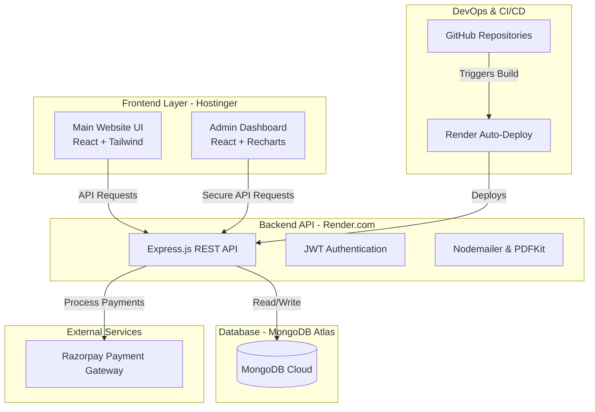

# SIT Xplore | Luxury Travel & Adventure Tours


SIT Xplore is a premium, full-stack tourism and travel booking platform designed to offer luxury travel and adventure experiences in North India. This application features a modern, fully responsive React frontend, a powerful Node.js/Express backend, and a complete admin dashboard for managing bookings and tour packages.

## 🌟 Key Features

### User Experience
- **Modern UI/UX:** Stunning, dynamic interface built with React and Tailwind CSS.
- **Dynamic Tour Packages:** Browse and filter adventure, luxury, and cultural tours.
- **Seamless Booking Flow:** Select travel dates, input passenger details, and choose add-ons seamlessly.
- **Live Payments:** Integrated with Razorpay for secure and instant online checkout.
- **Automated Ticketing:** Customers automatically receive a PDF e-ticket via email upon successful payment.
- **User Authentication:** Secure login and registration using JWT.

### Admin Dashboard
- **Analytics & Overview:** Track total revenue, bookings, and active packages in real-time.
- **Booking Management:** View, approve, or cancel upcoming user bookings.
- **Package Management:** Create, edit, and delete travel packages dynamically.
- **Secure Access:** Protected routes ensuring only authorized personnel can access business data.

## 🛠️ Technology Stack

- **Frontend:** React (Vite), Tailwind CSS, Lucide React (Icons), React Router, Axios.
- **Admin Panel:** React (Vite), Tailwind CSS, Recharts (Data Visualization).
- **Backend:** Node.js, Express.js, Mongoose.
- **Database:** MongoDB (Atlas).
- **Payments:** Razorpay API integration.
- **Email/PDF Generation:** Nodemailer (SMTP), PDFKit.

## 🚀 Live Deployment Architecture & DevOps

The application uses a decoupled microservices-style architecture to ensure scalability, cost-effectiveness, and automated CI/CD pipelines.

### DevOps Tools & CI/CD Pipeline
- **Version Control:** GitHub
- **Continuous Deployment (Backend):** Render CI/CD automatically triggers new builds and deploys upon pushes to the `main` branch.
- **Frontend Hosting & DNS:** Hostinger (cPanel/hPanel) serving static React files over a global CDN.
- **Database Management:** MongoDB Atlas Cloud Database.

### Architecture Diagram



## 💻 Local Development Setup

To run this project locally on your machine, follow these steps:

### Prerequisites
- Node.js (v18+)
- MongoDB (Local or Atlas)
- Razorpay Test Credentials

### 1. Backend Setup
```bash
cd backend
npm install
```
Create a `.env` file in the `backend` directory:
```env
PORT=5000
MONGODB_URL=mongodb://localhost:27017/sitxplore
JWT_SECRET=your_super_secret_key
SMTP_HOST=smtp.gmail.com
SMTP_PORT=465
SMTP_USER=your_email@gmail.com
SMTP_PASS=your_email_app_password
RAZORPAY_KEY_ID=your_razorpay_key_id
RAZORPAY_KEY_SECRET=your_razorpay_key_secret
```
Run the backend server:
```bash
npm run dev
```

### 2. Frontend Setup
```bash
cd frontend
npm install
npm run dev
```

### 3. Admin Panel Setup
```bash
cd admin
npm install
npm run dev
```

## 📝 License
This project is proprietary software belonging to SIT Xplore. All rights reserved.
